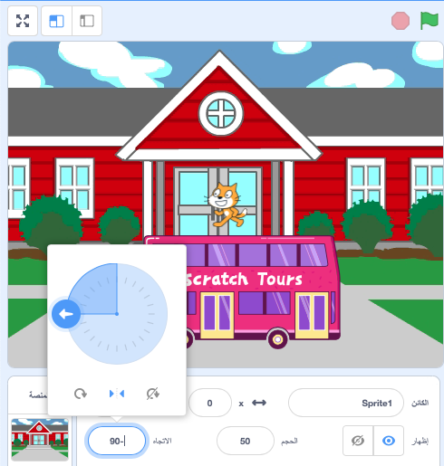

عند إضافة كائن ما ، يتم تعيين  `نمط التدوير`{:class="block3motion"} في `جميع أنحاء`{:class="block3motion"}. إذا جعلت نقطة الكائن يسارًا (-90 درجة) ، فسينقلب مظهر الكائن رأسًا على عقب عندما يدور الكائن!

في بعض الأحيان يكون هذا ما تريده ، ولكن إذا كان لديك كائن يتحرك إلى اليسار واليمين ، فغالبًا ما تريد أن يشير الكائن إلى اليسار أو اليمين حسب الاتجاه الذي يواجهه.

انقر على **يسار / يمين** في المنتصف لتغيير نمط التدوير إلى `يمين-يسار`{:class="block3motion"} لإيقاف انعكاس الكائن رأسًا على عقب:



هناك أيضًا مقاطع برمجية يمكنك استخدامها:

```blocks3
set rotation style [left-right v]
```

