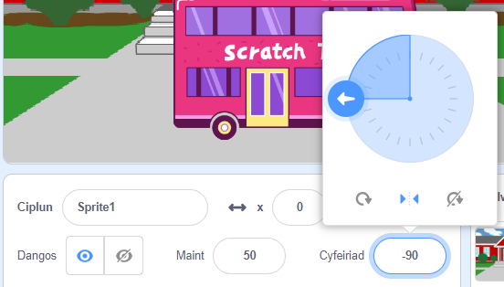

Pan fyddi di'n ychwanegu coflun, mae ei `arddull-cylchdroi`{:class="block3motion"} wedi'i osod ar `cylch cyfan`{:class="block3motion"}. If you make the sprite point left (-90 degrees) then the sprite costume will go upside down when the sprite rotates!

Weithiau byddi di am weld hyn yn digwydd, ond os yw dy goflun yn symud i'r chwith ac wedyn i'r dde, fel arfer rwyt ti am i'r coflun bwyntio i'r chwith neu'r dde yn dibynnu ar ba ffordd mae'n wynebu.

Clicia ar yr eicon **Chwith/Dde** yn y canol i newid yr arddull cylchdroi i `chwith-dde`{:class="block3motion"} i atal y coflun rhag troi ben i waered:



Mae yna hefyd floc cod y galli di ei ddefnyddio:

```blocks3
gosod steil cylchdroi [left-right v]
```

