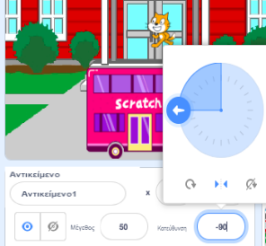

Όταν προσθέτεις ένα αντικείμενο, ο `τρόπος περιστροφής`{:class="block3motion"} του είναι εξ ορισμού `τριγύρω `{:class="block3motion"}. Αν κάνεις το αντικείμενο να κατευθύνεται προς τα αριστερά (-90 μοίρες) τότε η ενδυμασία του αντικειμένου θα γυρίσει ανάποδα όταν το αντικείμενο περιστρέφεται!

Μερικές φορές αυτό είναι αυτό που θέλεις, αλλά αν έχεις ένα αντικείμενο που κινείται δεξιά και αριστερά, συχνά θέλεις το αντικείμενο να δείχνει αριστερά ή δεξιά ανάλογα με την κατεύθυνση που βλέπει.

Κάνε κλικ στην εικόνα **Αριστερά/Δεξιά** στη μέση για να αλλάξεις τον τρόπο περιστροφής σε `αριστερά-δεξιά`{:class="block3motion"} για να σταματήσει να γυρίζει ανάποδα ένα αντικείμενο:



Υπάρχει επίσης ένα μπλοκ κώδικα που μπορείς να χρησιμοποιήσεις:

```blocks3
set rotation style [left-right v]
```

