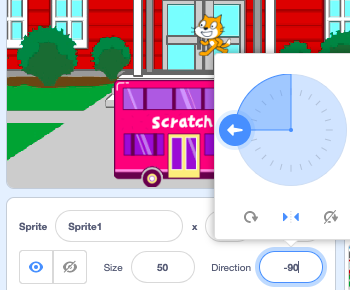

When you add a sprite, its `rotation-style`{:class="block3motion"} is set to `all around`{:class="block3motion"}. If you make the sprite point left (-90 degrees) then the sprite costume will go upside down when the sprite rotates!

Sometimes this is what you want, but if you have a sprite that moves left and right then you often want the sprite to point left or right depending on the direction it is facing.

Click on the **Left/Right** icon in the middle to change the rotation style to `left-right`{:class="block3motion"} to stop a sprite turning upside down:



There's also a code block that you can use:

```blocks3
set rotation style [left-right v]
```

