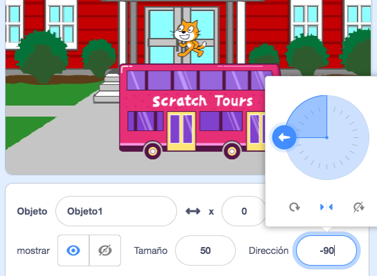

Cuando agregas un objeto, tiene un `estilo de rotación`{:class="block3motion"} `en todas las direcciones`{:class="block3motion"}. Si haces que el objeto apunte a la izquierda (-90 grados), ¡el disfraz del objeto se pondrá boca abajo cuando este gire!

A veces esto es lo que quieres, pero si tienes un objeto que se mueve de izquierda a derecha, a menudo querrás que el objeto apunte hacia la izquierda o hacia la derecha dependiendo de la dirección a la que esté mirando.

Haz clic en el icono **Izquierda/Derecha** que está al medio para cambiar el estilo de rotación a `izquierda-derecha`{:class="block3motion"} para evitar que un objeto se dé la vuelta:



También hay un bloque de código que puedes usar:

```blocks3
set rotation style [left-right v]
```

