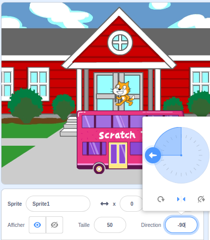

Lorsque tu ajoutes un sprite, son `sens de rotation`{:class="block3motion"} est défini `à 360°`{:class="block3motion"}. Si tu orientes le sprite vers la gauche (-90 degrés), le costume de sprite ira à l'envers lorsque le sprite tournera !

Parfois, c'est ce que tu veux, mais si tu as un sprite qui se déplace à gauche et à droite, tu veux souvent que le sprite pointe vers la gauche ou la droite en fonction de la direction dans laquelle il fait face.

Clique sur l'icône **Gauche/Droite** au milieu pour changer le style de rotation en `gauche-droite`{:class="block3motion"} pour empêcher un sprite de tourner à l'envers :



Il existe également un bloc de code que tu peux utiliser :

```blocks3
set rotation style [left-right v]
```

