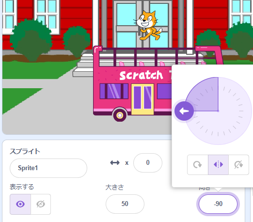

スプライトを追加すると、その`回転方法`{:class="block3motion"}は`自由に回転`{:class="block3motion"}に設定されます。 スプライトを回転させて左(-90度)に向けると、スプライトのコスチュームが逆さまになってしまいます。

これが望ましいときもありますが、スプライトを左右に動かすときには、スプライトが動く方向に応じてスプライトを右や左に向けたいでしょう。

中央にある**左右のみ**アイコンをクリックして回転方法を`左右のみ`{:class="block3motion"}に変更し、スプライトが上下逆さまにならないようにします。



コードブロックを使用することもできます。

```blocks3
set rotation style [left-right v]
```

