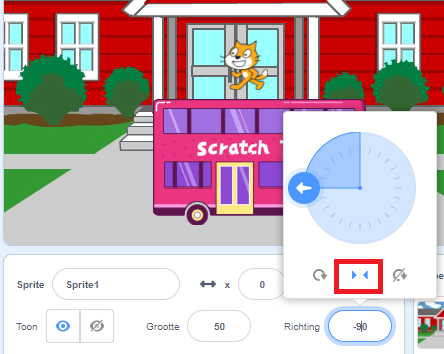

Wanneer je een sprite toevoegt, wordt de `draaistijl`{:class="block3motion"} ingesteld op `helemaal rond`{:class="block3motion"}. If you make the sprite point left (-90 degrees) then the sprite costume will go upside down when the sprite rotates!

Soms is dit wat je wilt, maar als je een sprite hebt die naar links en rechts beweegt, wil je vaak dat de sprite naar links of rechts wijst, afhankelijk van de richting waarin hij kijkt.

Klik op het **Links/Rechts** icoon in het midden om de rotatiestijl te veranderen in `links-rechts`{:class="block3motion"} om te voorkomen dat een sprite ondersteboven draait:



Er is ook een codeblok dat je kunt gebruiken:

```blocks3
set rotation style [left-right v]
```

