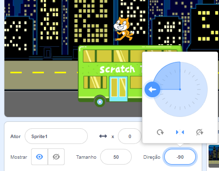

Quando você adiciona um ator, seu `estilo-rotação`{:class="block3motion"} é definido como `rotação completa`{:class="block3motion"}. Se você apontar o ator para a esquerda (-90 graus), a fantasia do ator ficará de cabeça para baixo quando o ator girar!

Às vezes é isso que você quer, mas se você tem um ator que se move para a esquerda e para a direita, muitas vezes você quer que o ator aponte para a esquerda ou para a direita, dependendo da direção para a qual está voltado.

Clique no ícone **Esquerda/Direita** no meio para alterar o estilo de rotação para `esquerda-direita`{:class="block3motion"} para impedir que um ator vire de cabeça para baixo:



Há também um bloco de código que você pode usar:

```blocks3
set rotation style [left-right v]
```

