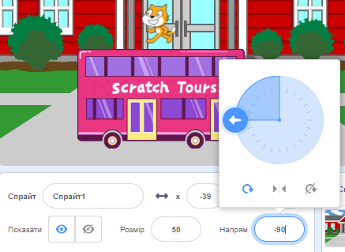

Коли ти додаєш спрайт, його `стиль обертання`{:class="block3motion"} встановлений на `навколо`{:class="block3motion"}. Якщо зробити точку спрайта ліворуч (-90 градусів), то при обертанні спрайта образ буде перевертатися головою вниз!

Іноді саме це і потрібно, але якщо у тебе є спрайт, який рухається вліво і вправо, то зазвичай ти хочеш, щоб спрайт вказував вліво або вправо в залежності від напрямку, в якому він стоїть.

Натисни на іконку **Зліва-направо**, яка знаходиться посередині, щоб змінити стиль обертання на `вліво-вправо`{:class="block3motion"}, щоб зупинити спрайт, який перевернувся головою вниз:



Також є блок коду, яким ти можеш скористатися:

```blocks3
set rotation style [left-right v]
```

